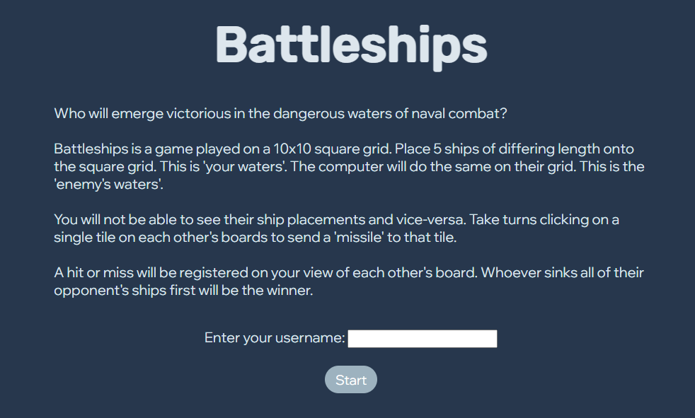
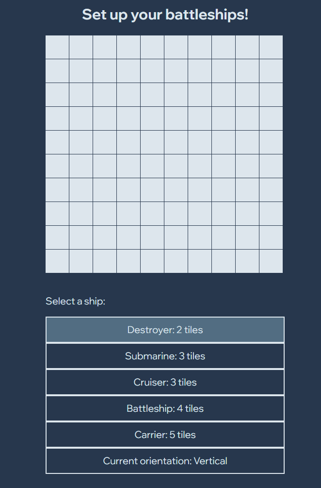
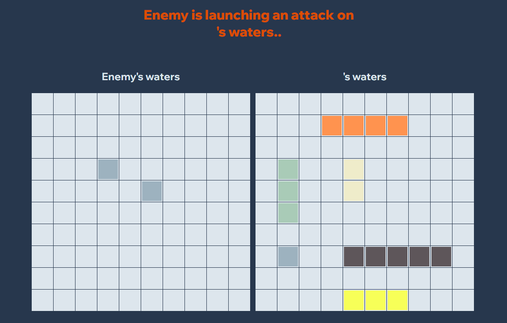

# Battleships
Who will emerge victorious in the dangerous waters of naval combat? 
 

* Battleships is a game played on a 10x10 square grid.
* Place 5 ships of differing length onto the square grid. This is 'your waters'.
* The computer will do the same on their grid. This is the 'enemy's waters'.
* You will not be able to see their ship placements and vice-versa.
* Take turns clicking on a single tile on each other's boards to send a 'missile' to that tile.
* A hit or miss will be registered on each other's board as you play.
* Whoever sinks all of their opponent's ships first will be the winner.

# Screenshot(s)

 
Early development: AI randomly placing ships: 

# Technologies Used
HTML, CSS and Javascript

# Getting Started
Visit https://battleships-iota.vercel.app/ and start playing straight away!

# Next Steps
* Expandable board
* Better AI (Easy, Medium, Hard, Insane etc.)

