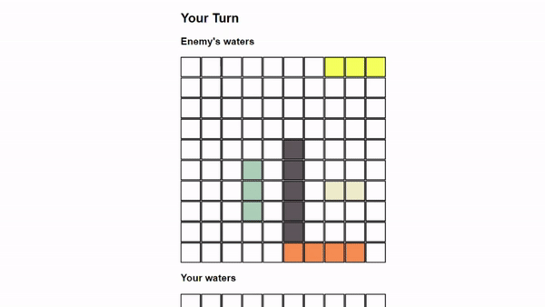

# Battleships
Who will emerge victorious in the dangerous waters of naval combat? 
 
 
Battleships is a game played on a 10x10 square grid.
 
Place 5 ships of differing length onto the square grid. This is 'your waters'.
The computer will do the same on their grid. This is the 'enemy's waters'.
 
You will not be able to see their ship placements and vice-versa.
Take turns clicking on a single tile on each other's boards to send a 'missile' to that tile.
 
A hit or miss will be registered on each other's board as you play.
Whoever sinks all of their opponent's ships first will be the winner.

# Screenshot(s)

 
Early development: AI randomly placing ships: 

# Technologies Used
HTML, CSS and Javascript

# Getting Started
Visit https://battleships-iota.vercel.app/ and start playing straight away!

# Next Steps
Expandable board
Better AI (Easy, Medium, Hard, Insane etc.)
